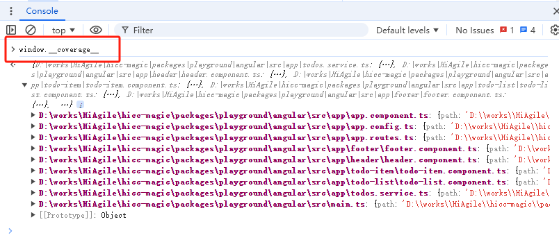
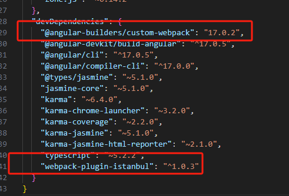

# Hi-CC魔法球：angualr6+ 示例项目
- [Hi-CC魔法球](https://gitee.com/thm1118/hi-cc-magic)是 上海惠艾信息科技有限公司的前端测试覆盖率度量展示工具，通过浏览器插件方式，帮助测试人员/开发人员在测试过程中，能实时获知被测页面的代码覆盖率情况，同时反馈未被测试的代码的行号以便及时补测，是研发测试的**防漏测神器**。
- [Hi-CC魔法球](https://gitee.com/thm1118/hi-cc-magic)提供测试历史覆盖率记录，可累计当天最高覆盖率，累计近期最高覆盖率。
- [Hi-CC魔法球](https://gitee.com/thm1118/hi-cc-magic) 可通过浏览器插件部署，也支持混合移动App（企业版），更详细说明参阅 Hi-CC 官网
- [Hi-CC魔法球](https://gitee.com/thm1118/hi-cc-magic) 的 [安装说明](https://gitee.com/thm1118/hi-cc-magic#%E5%BF%AB%E9%80%9F%E5%85%A5%E9%97%A8%E5%A6%82%E4%BD%95%E4%B8%8B%E8%BD%BD)

|  | 
|:--:| 
| *基本功能演示: 点击图片可全屏* |

- Hi-CC魔法球 支持现代前端的三大主流框架 Vue/Anguarl/React

## 实现原理
- 前端代码在部署前需要 使用istanbul工具对代码"插桩"
- “插桩”后的代码在浏览器运行时会输出覆盖率数据，在浏览器中打开控制台F12，键入 `window.__coverage__`可看到覆盖率数据。
- Hi-CC魔法球基于此数据计算并呈现。
- 在览器扩展安装后，如果 检测到`window.__coverage__`是有效存在的，则会应显示浏览器扩展的魔法球，未检测到，不会显示魔法球。

## 如何“插桩"
- 本仓库演示基于Angular6+ 框架的istanbul覆盖率插桩。 
  - 如需查看vue2.6 的istanbul覆盖率插桩 ，请访问[vue2.6示例](https://gitee.com/thm1118/vue2.6-hicc-magic-demo)
  - 如需查看vue2.5 的istanbul覆盖率插桩 ，请访问[vue2.5示例](https://gitee.com/thm1118/vue2-hicc-magic-demo)
  - 如需查看vue3 的istanbul覆盖率插桩，请访问[vue3 示例](https://gitee.com/thm1118/vue3-hicc-magic-demo)  
  - 如需查看react 的istanbul覆盖率插桩，请访问[react17 示例](https://gitee.com/thm1118/react17-hicc-magic-demo)


- Angular6+，使用@angular/cli 构建，内部基于webpack5+工具链，需要通过扩展webpack构建配置的方式来 插桩。
- 在项目根目录下执行 `yarn add -D webpack-plugin-istanbul @angular-builders/custom-webpack` 安装插件，成功后在`package.json`内会有安装的两个插件
- 创建自定义 webpack配置文件，如[extra-webpack.config.ts](./extra-webpack.config.ts), 添加插桩规则，对ts文件插桩，并排除测试代码
```typescript
module: {
    rules: [
      {
        test: /\.(js|ts)$/,
        exclude: /node_modules/,
        use: {
          loader: "webpack-plugin-istanbul/loader",
          options: {
            include: ["src/**/*.ts"],
            exclude: ["src/**/*.spec.ts"],
            extension: [".ts"],
            cwd: process.cwd(),
          },
        },
        enforce: 'post',
      },
    ]
  }
```
- 注意其中 enforce的post，是有Babel的情况下，需要在 post 步骤 插桩

- 在angular构建配置文件 [angular.json](angular.json) 中，在 `architect/build` 节点内，替换原来的builder 内容 `@angular-devkit/build-angular:dev-server` 为  `@angular-builders/custom-webpack:dev-server`; 以及 替换 `"@angular-builders/build-angular:browser` 为 `"@angular-builders/custom-webpack:browser` ，并引用自定义的 [extra-webpack.config.ts](./extra-webpack.config.ts)文件
```typescript
...
      "architect": {
        "build": {
          "builder": "@angular-builders/custom-webpack:browser",
          "options": {
            "customWebpackConfig": {
              "path": "./extra-webpack.config.ts"
            },
...
```

- 可参考 [angular.json](angular.json)完整实现


## 项目构建
- 项目构建
  - 执行 `yarn run build` 或`npm run build` 构建
  - 构建输出到 `dist`目录下
- 如果需要快速演示，[dist](/dist/)目录是已构建好的SIT环境配置。可以用node工具`serve`或其他本地http服务工具快速启动演示,
    - `serve`命令安装 ：`yarn global add serve`
    - 在dist目录下，启动一个命令行窗口，运行 `serve`,即可开启http服务 `http://localhost:3000/`

